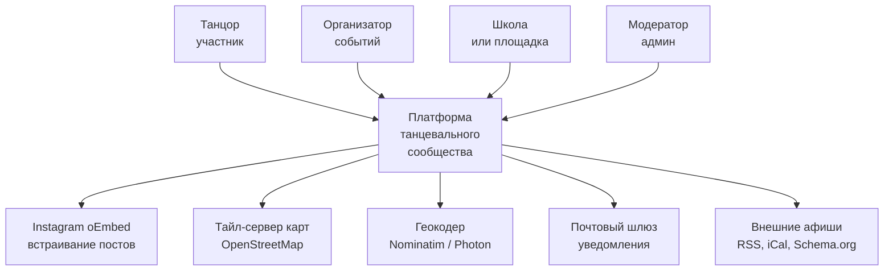
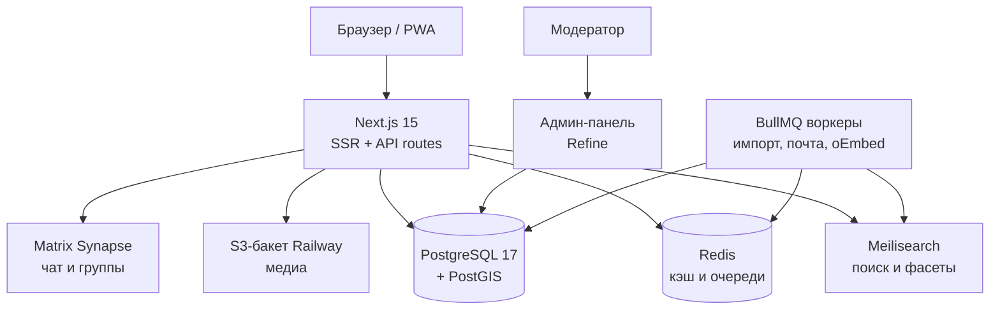
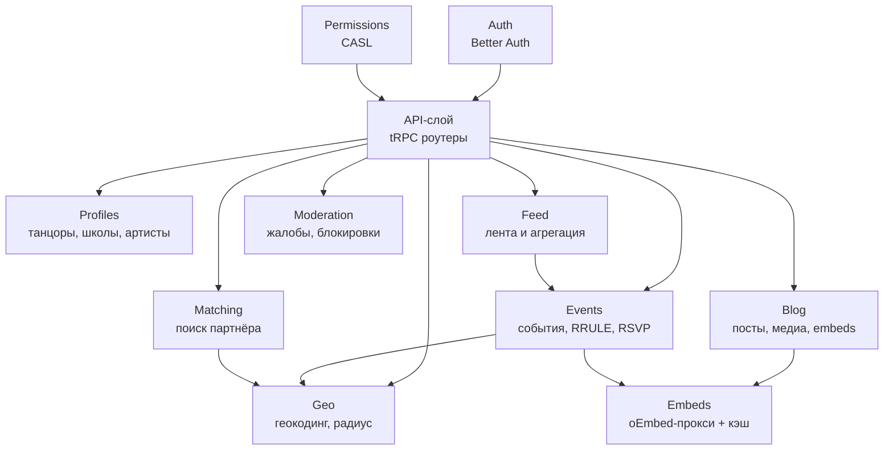
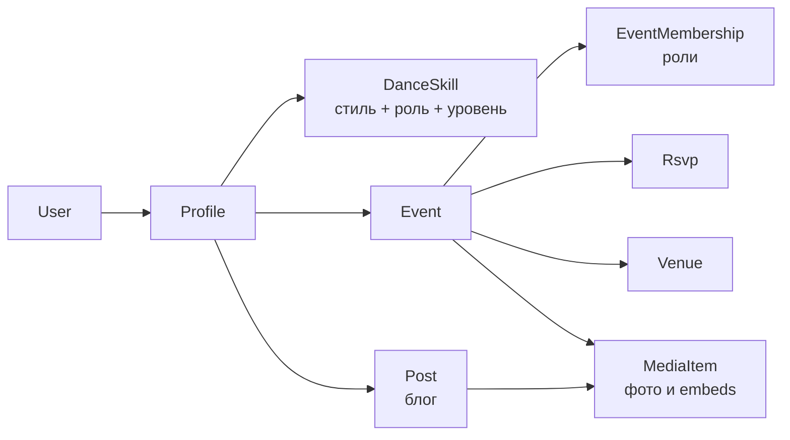

# Технические требования: платформа танцевального сообщества

Sep 22, 2026 · @Aleksandr Mazalov

> **Изменение от 1 октября 2026.** Хостинг всей платформы — Railway. Первоначальный вариант «Hetzner + Coolify на одном узле» отменён решением владельца продукта. Разделы «Объём и принципы», «C4 уровень 2», «Технологический стек», «Нефункциональные требования», эпик E1 и таблица рисков приведены в соответствие. Порядок выпуска описан в `docs/deployment.md`, воркер — в `docs/worker.md`.
>
> **Изменение от 1 октября 2026, роли школ.** Добавлены роли платформы «владелец» и «администратор школы» и кабинет школы — раздел «Роли и управление школами» ниже. В исходном ТЗ их не было; реализовано миграцией `202610010007_school_rbac`.

Платформа для социальных танцев: события на карте и в календаре, профили и поиск партнёра по уровню, личный блог с фото и встроенными постами Instagram, чат и группы, автособираемая лента новостей. Стек — только open source, админ-панель берётся готовой.

## Объём и принципы

Строим с нуля на современном стеке; WeDance 3.0 используем как источник доменной модели и UX-решений, а не как кодовую базу. Причина: v3 работает на Vue 2 и Nuxt 2, обе платформы прошли End of Life (Vue 2 — 31 декабря 2023, Nuxt 2 — 30 июня 2024), а v4 не имеет файла лицензии, то есть по умолчанию «все права защищены» и форку не подлежит.

Четыре принципа, которым подчинены все решения ниже.

1. **Покупаем, а не пишем.** Аутентификация, админ-панель, чат, поиск, карты, очереди — готовые open-source компоненты. Пишем сами только то, что составляет уникальную ценность: события с ролями, матчинг партнёров, агрегация афиши.
2. **Только open source в коде, хостинг — Railway.** Весь программный стек — свободные лицензии: MIT, Apache-2.0, BSD, AGPL для отдельно стоящих сервисов (чат, поиск), которые мы не линкуем в свой код. Никаких per-MAU тарифов. Платформа размещается на Railway как набор сервисов из одного репозитория; привязки к Railway в коде нет — используются только стандартные интерфейсы (PostgreSQL, Redis, S3, SMTP, переменные окружения), поэтому переезд на другой хостинг не требует переписывания.
3. **Instagram — только встраивание по ссылке.** Бизнес- и Creator-аккаунты не требуются, OAuth с Meta не делаем, App Review не проходим. Пользователь вставляет ссылку на публичный пост — платформа показывает его карточкой. Это снимает главный внешний риск проекта.
4. **Один код на веб и мобильный.** PWA с первого дня, нативная оболочка (Capacitor) — позже, только если понадобятся магазины приложений.

Границы первой версии: не делаем продажу билетов и платежи, не делаем видео-хостинг, не делаем федерацию ActivityPub, не публикуем контент обратно в Instagram. Всё это — кандидаты на v2 и позже.

## Функциональный каталог

Восемь функций из исходного запроса плюс десять, которые есть в WeDance 3.0 и не были названы, но составляют рабочий минимум такой платформы. Колонка «Источник» показывает, откуда требование: «запрос» — ваш список, «WeDance 3.0» — перенос из существующего проекта.

| Код | Функция | Источник | Фаза |
| --- | --- | --- | --- |
| F1 | Создание события, публичная страница, шеринг ссылкой и в соцсети | запрос | MVP |
| F2 | Роли на событии: организатор, со-организатор, участник, артист | запрос | MVP |
| F3 | Фото события и встроенные посты Instagram по ссылке | запрос | MVP |
| F4 | События на карте с кластеризацией и поиском по радиусу | запрос | MVP |
| F5 | Поиск партнёра по стилю, уровню, роли ведущий/следующий и городу | запрос | v1 |
| F6 | Личный танцевальный блог с фото и встроенными постами Instagram | запрос | MVP |
| F7 | Чат один-на-один и групповые чаты | запрос | v1 |
| F8 | Автособираемая лента новостей и афиши из внешних источников | запрос | v2 |
| F9 | Справочник танцевальных стилей: дерево из 170+ стилей, фильтры и подписки по стилю | WeDance 3.0 | MVP |
| F10 | Города как первичная навигация: городская афиша, подписка на город, переключатель города | WeDance 3.0 | MVP |
| F11 | Профили школ, студий, площадок и артистов — в том числе «заглушки» без владельца, с последующим захватом | WeDance 3.0 | v1 |
| F12 | Регулярные занятия и курсы: расписание недели, уровень, цена, привязка к площадке | WeDance 3.0 | v1 |
| F13 | Повторяющиеся события по правилу RRULE: еженедельные вечеринки и практики | WeDance 3.0 | MVP |
| F14 | RSVP с раздельными статусами «иду» / «интересно», список участников, счётчик | WeDance 3.0 | MVP |
| F15 | Email-дайджест: что происходит в моём городе на этой неделе | WeDance 3.0 | v1 |
| F16 | Импорт событий из внешних сайтов: Schema.org Event, iCal, RSS | WeDance 3.0 | v2 |
| F17 | Telegram-бот: поиск событий и уведомления без захода на сайт | WeDance 3.0 | v2 |
| F18 | Мультиязычный интерфейс: русский, английский, испанский минимум | WeDance 3.0 | MVP |
| F19 | Модерация пользовательского контента: жалобы, очередь, блокировки | новое | MVP |
| F20 | Экспорт события в календарь: iCal-файл и ссылка на Google Calendar | WeDance 3.0 | MVP |

Две функции WeDance 3.0 сознательно не переносим. Продажу билетов и приём платежей — это отдельный продукт с эквайрингом, возвратами и налоговой отчётностью, добавляем только если появится платящий спрос. Федерацию ActivityPub — она удваивает сложность модели данных ради обмена событиями с Mobilizon-инстансами, которых на всё сообщество меньше сотни.

## C4 уровень 1 — системный контекст

Платформа обслуживает четыре типа пользователей и зависит от пяти внешних систем. Все внешние зависимости кроме почты заменяемы или необязательны — это осознанное требование к отказоустойчивости.



Танцор ищет события и партнёров, ведёт блог, вступает в группы. Организатор создаёт события, назначает со-организаторов, видит списки участников. Школа ведёт профиль площадки и расписание занятий. Модератор разбирает жалобы через отдельную админ-панель.

Instagram вызывается только за oEmbed-разметкой конкретного поста, токен не нужен: с 15 июня 2026 Meta вернула бестокенный доступ к oEmbed. Геокодер и тайл-сервер работают по OpenStreetMap и при необходимости поднимаются локально. Внешние афиши опрашиваются фоновыми задачами, недоступность источника не влияет на работу платформы.

## C4 уровень 2 — контейнеры

Восемь контейнеров, все размещаются на Railway отдельными сервисами одного проекта и общаются по его приватной сети. Сервисы приложения (веб, админ-панель, воркеры) собираются из одного репозитория и ветки `deploy`; база, Redis и хранилище — управляемые сервисы Railway. Локальная разработка по-прежнему идёт через `docker-compose`. Монолит с выделенными воркерами: разделение на микросервисы на этом масштабе даёт только накладные расходы.



| Контейнер | Технология | Отвечает за |
| --- | --- | --- |
| Веб-приложение | Next.js 15, React 19, TypeScript | SSR страниц, REST/tRPC API, авторизация, рендер карты и календаря |
| База данных | PostgreSQL 17 + PostGIS 3.5 | Все доменные данные, гео-запросы, полнотекстовый поиск на старте |
| Поиск | Meilisearch | Поиск событий, профилей, партнёров; фасеты по стилю, уровню, городу |
| Кэш и очереди | Redis 7 | Сессии, кэш oEmbed-ответов, очереди BullMQ |
| Воркеры | Node.js + BullMQ | Импорт афиш, рассылка дайджестов, обновление oEmbed, обработка изображений |
| Хранилище медиа | S3-совместимый бакет Railway | Оригиналы фото, превью, аватары |
| Чат | Matrix Synapse + Element Web | Личные сообщения, групповые комнаты, модерация |
| Админ-панель | Refine + shadcn/ui | CRUD над всеми сущностями, очередь модерации, управление справочниками |

Воркеры работают отдельным сервисом Railway с той же кодовой базой: общие Prisma-модели, разный entrypoint (`railway.worker.json`), публичный домен им не нужен. Миграции применяет только веб-сервис на этапе pre-deploy; воркер запускается после совместимого выпуска веба. Matrix Synapse поднимается как самостоятельный сервис (AGPL-3.0) и общается с платформой только по HTTP — линковки в наш код нет, поэтому copyleft на него не распространяется.

## C4 уровень 3 — компоненты ядра

Внутри веб-приложения семь доменных модулей поверх трёх инфраструктурных. Каждый модуль владеет своими таблицами и не лезет в чужие напрямую — только через сервисный слой соседа.



**Events** хранит события, развёртывает правила повторения RRULE в конкретные даты, ведёт RSVP и роли на событии. **Profiles** держит профили четырёх типов — танцор, организатор, школа, площадка — включая «заглушки» артистов без владельца, которые потом можно захватить по подтверждению. **Matching** строит кандидатов партнёров: фильтрация по стилю, совместимой роли и радиусу, затем скоринг по близости уровня и активности.

**Blog** ведёт посты пользователя; медиа он кладёт в хранилище, а внешние ссылки отдаёт модулю **Embeds**. Embeds — единственная точка выхода на Instagram: принимает URL поста, запрашивает oEmbed, кэширует разметку в Redis и Postgres, отдаёт готовый блок. Если Meta недоступна или пост удалён, Embeds возвращает деградированную карточку со ссылкой, а не ошибку.

**Feed** собирает персональную ленту: события в городах и стилях подписки, посты тех, на кого подписан пользователь, импортированные новости. **Geo** инкапсулирует геокодинг и радиусные запросы PostGIS, чтобы смена провайдера карт не трогала доменные модули. **Moderation** принимает жалобы и выставляет флаги, которые читает админ-панель.

Auth и Permissions — сквозные: Better Auth даёт сессию, CASL проверяет права на каждом вызове API по правилу «роль в контексте объекта», а не по глобальной роли пользователя.

## Технологический стек

Всё перечисленное в стеке приложения — свободные лицензии. Хостинг — Railway: это единственная платная платформа в проекте, оплата по фактическому потреблению. Единственная внешняя зависимость с чужими правилами в самом продукте — oEmbed Meta, и он не критичен.

| Слой | Решение | Лицензия | Почему это |
| --- | --- | --- | --- |
| Фреймворк | Next.js 15 + React 19 + TypeScript | MIT | Самый широкий рынок найма, SSR для SEO афиши, один код на веб и PWA |
| API | tRPC | MIT | Сквозная типизация без генерации схем, быстрее REST в разработке |
| ORM | Prisma | Apache-2.0 | Типобезопасность, миграции; сырой SQL для PostGIS через `$queryRaw` |
| База | PostgreSQL 17 + PostGIS 3.5 | PostgreSQL / GPL-2.0 | Гео-запросы `ST_DWithin` по индексу GiST, полнотекст, JSONB |
| Аутентификация | Better Auth | MIT | Данные в своей БД, без per-MAU тарифа; Auth.js с конца 2025 в maintenance |
| Права | CASL | MIT | Правила вида «со-организатор этого события», а не глобальные роли |
| Карта | MapLibre GL JS | BSD-3-Clause | Форк Mapbox GL v1.13 до смены лицензии, без биллинга и лимитов |
| Тайлы | OpenFreeMap или свой tileserver-gl | BSD / открытые данные | Нулевая стоимость, возможность полного self-host |
| Геокодинг | Nominatim (свой инстанс) | GPL-2.0 | Без лимита 1 req/s публичного сервиса; Photon для автодополнения |
| Кластеризация | supercluster | ISC | Держит десятки тысяч маркеров на клиенте |
| Календарь | FullCalendar (стандартные плагины) | MIT | Премиум-плагины не нужны; месяц, неделя, список |
| Повторения | rrule.js | BSD-3-Clause | RFC 5545, тот же формат, что понимают Google Calendar и Apple |
| Экспорт календаря | ical-generator | MIT | Файлы .ics и подписные фиды |
| Даты и зоны | Luxon | MIT | Хранение в UTC + IANA-зона отдельным полем |
| Поиск | Meilisearch | MIT | Опечатки, фасеты, русская и испанская морфология из коробки |
| Редактор блога | TipTap (ядро) | MIT | Headless на ProseMirror, расширяется блоком Instagram-эмбеда |
| Очереди | BullMQ | MIT | Ретраи, расписания, dead-letter; работает на том же Redis |
| Хранилище | S3-совместимый бакет Railway | — (сервис платформы) | Код работает через стандартный S3 API и presigned URL; смена на R2 или MinIO — только переменные окружения. MinIO остаётся необязательным профилем для локальной разработки |
| Обработка картинок | sharp + imgproxy | Apache-2.0 / MIT | Превью на лету, WebP/AVIF, защита от «бомб» |
| Чат | Matrix Synapse + Element Web | Apache-2.0 | Комнаты, ЛС, модерация, мобильные клиенты; отдельный сервис |
| Админ-панель | Refine + shadcn/ui | MIT | См. отдельный раздел ниже |
| Локализация | next-intl | MIT | Маршруты вида `/ru/`, `/es/`, ICU-плюрализация |
| Почта | Postal или Listmonk + свой SMTP | MIT / AGPL-3.0 | Транзакционные письма и дайджесты без SaaS |
| Ошибки и метрики | GlitchTip + Grafana + Loki | MIT / AGPL-3.0 | Замена Sentry, совместима с его SDK |
| Хостинг | Railway | — (PaaS) | Сервисы веб, админ-панель и воркер из одного репозитория; управляемые PostgreSQL с PostGIS и Redis; автодеплой из ветки `deploy` после прохождения CI; TLS и домены средствами платформы; оплата по потреблению |

Две замены, которые стоит держать в уме. Meilisearch на старте можно не поднимать вовсе — до нескольких десятков тысяч записей хватает полнотекстового поиска PostgreSQL с `tsvector`. Matrix избыточен, если чат нужен простой: тогда WebSocket на Socket.io внутри монолита обойдётся дешевле в эксплуатации, но потеряет мобильные клиенты и федерацию.

## Модель данных

Ядро — девять сущностей. Ключевое решение: профиль отделён от пользователя, потому что у школы или артиста профиль может существовать до того, как появится владелец аккаунта. Это прямой перенос из WeDance 3.0, где события можно привязывать к артистам, которых ещё нет на платформе.



Схема ключевых моделей. Координаты хранятся дважды: `lat`/`lng` для чтения кодом и колонка `geo` типа `geography` для индексированных запросов — Prisma не типизирует PostGIS, поэтому она объявлена как `Unsupported`.

```
enum ProfileType { DANCER ORGANIZER SCHOOL VENUE ARTIST }
enum DanceRole   { LEADER FOLLOWER BOTH }
enum SkillLevel  { NEWCOMER BEGINNER INTERMEDIATE ADVANCED PRO }
enum EventRole   { OWNER CO_ORGANIZER ARTIST ATTENDEE }
enum RsvpStatus  { GOING INTERESTED DECLINED }

model Profile {
  id         String      @id @default(cuid())
  userId     String?     @unique        // null = заглушка без владельца
  type       ProfileType
  handle     String      @unique
  name       String
  bio        String?
  instagram  String?                     // юзернейм, не токен
  cityId     String?
  lat        Float?
  lng        Float?
  geo        Unsupported("geography(Point,4326)")?
  skills     DanceSkill[]
  posts      Post[]
  @@index([cityId, type])
}

model DanceSkill {
  id            String     @id @default(cuid())
  profileId     String
  styleId       String
  role          DanceRole
  level         SkillLevel
  lookingFor    Boolean    @default(false)  // ищу партнёра по этому навыку
  @@unique([profileId, styleId, role])
  @@index([styleId, level, lookingFor])
}

model Event {
  id          String   @id @default(cuid())
  slug        String   @unique
  title       String
  description String?
  startsAt    DateTime            // UTC
  endsAt      DateTime?
  timezone    String              // "America/Mexico_City"
  rrule       String?             // "FREQ=WEEKLY;BYDAY=TH"
  venueId     String?
  cityId      String
  lat         Float?
  lng         Float?
  geo         Unsupported("geography(Point,4326)")?
  styleIds    String[]
  status      String   @default("published")
  sourceUrl   String?             // заполняется импортом
  members     EventMembership[]
  rsvps       Rsvp[]
  @@index([cityId, startsAt])
}

model EventMembership {
  eventId   String
  profileId String
  role      EventRole
  @@id([eventId, profileId, role])
}

model MediaItem {
  id          String   @id @default(cuid())
  postId      String?
  eventId     String?
  kind        String   // "upload" | "instagram"
  storageKey  String?  // для upload
  sourceUrl   String?  // permalink поста Instagram
  embedHtml   String?  // кэш oEmbed
  embedFetched DateTime?
  @@index([sourceUrl])
}
```

Гео-индекс и запрос по радиусу создаются миграцией вручную, минуя Prisma:

```
CREATE EXTENSION IF NOT EXISTS postgis;
CREATE INDEX event_geo_idx ON "Event" USING GIST (geo);

-- события в радиусе 25 км, ближайшие первыми
SELECT id, title,
       ST_Distance(geo, ST_MakePoint($1, $2)::geography) AS dist
FROM "Event"
WHERE startsAt > now()
  AND ST_DWithin(geo, ST_MakePoint($1, $2)::geography, $3)
ORDER BY dist ASC
LIMIT 50;
```

`ST_DWithin` выбран намеренно: по документации PostGIS он использует пространственный индекс, тогда как сравнение через `ST_Distance` — нет, и на нескольких тысячах событий разница уже заметна. Справочники городов и стилей — отдельные таблицы с деревом стилей через `parentId`: «бачата» → «доминиканская», «сенсуал».

## Instagram и медиа

Пользователь вставляет ссылку на свой публичный пост — платформа показывает его карточкой. Аккаунт Instagram не подключается, OAuth не проходится, бизнес-аккаунт не требуется, App Review не нужен. Это убирает из проекта единственную зависимость, способную заблокировать релиз.

Механика в четырёх шагах. Пользователь вставляет URL вида `instagram.com/p/{код}` или `/reel/{код}` в редактор блога либо в форму события. Сервер валидирует домен и форму ссылки, затем вызывает `GET https://graph.facebook.com/v25.0/instagram_oembed?url=...` без токена — Meta вернула бестокенный доступ 15 июня 2026, App Review для oEmbed больше не требуется. Полученный HTML и превью кладутся в `MediaItem` и в Redis на 24 часа. В ленте и на странице рендерится карточка: превью, автор, подпись, ссылка на оригинал.

Четыре правила, которые нельзя нарушать.

1. **Ссылки на профиль не работают.** oEmbed принимает только URL отдельного поста или reels; `instagram.com/username` возвращает ошибку. В форме должна быть подсказка «ссылка на конкретный пост, не на профиль» и понятное сообщение об ошибке.
2. **Запрос идёт только с сервера.** Прямой вызов из браузера упирается в CORS и раскрывает частоту обращений. Прокси-эндпоинт `/api/embed` с кэшем и защитой от перебора.
3. **Ответ всегда деградирует мягко.** Если Meta недоступна, пост удалён или стал приватным — показываем карточку со ссылкой и заголовком, а не пустое место и не ошибку. Кэш `embedHtml` позволяет пережить недоступность Meta без потери страниц.
4. **Медиа Instagram не копируются на наш диск.** Мы храним только `permalink` и oEmbed-разметку. Это снимает вопросы Platform Terms Meta о кэшировании пользовательского контента и требование удалять его по запросу в течение 24 часов.

Прямая загрузка фото остаётся основным путём для медиа. Она надёжнее: файл лежит в S3-бакете, превью генерируются `sharp`, ничего не ломается при изменениях на стороне Meta. Instagram-эмбед — дополнение для тех, кто уже выложил фотографии с фестиваля и не хочет загружать их второй раз.

Лимиты бестокенного oEmbed Meta публично не документирует — **недостаточно информации**. Поэтому кэш обязателен с первого дня, а не как оптимизация: один и тот же пост, встроенный сотней пользователей, должен давать один запрос к Meta в сутки.

## Админ-панель

Админ-панель не пишется с нуля. Берём Refine — headless-фреймворк админок на React, лицензия MIT, работает с тем же Next.js и тем же Prisma, что и основное приложение. CRUD, фильтры, пагинация, права и аудит приходят готовыми; мы описываем только ресурсы и кастомные экраны модерации.

| Кандидат | Лицензия | Стек | Вердикт |
| --- | --- | --- | --- |
| Refine | MIT | React, любой бэкенд | **Выбран.** Тот же стек, headless, кастомные экраны без борьбы с фреймворком |
| React-Admin | MIT (ядро) | React | Зрелый, но часть нужных модулей в платной Enterprise Edition |
| AdminJS | MIT | Node, есть адаптер Prisma | Быстрее всего стартует, но жёсткий UI, сложно делать очередь модерации |
| Directus | BSL 1.1 → BSD через 4 года | Отдельный сервис поверх той же БД | Мощно, но своя схема поверх нашей и небесплатен при выручке свыше порога |
| Strapi | MIT (Community) | Отдельный сервис | Это CMS, а не админка над чужой схемой |
| Filament | MIT | Laravel/PHP | Лучший в классе, но тянет второй язык в проект |
| Appsmith / Tooljet | Apache-2.0 | Low-code, отдельный сервис | Хорош для внутренних дашбордов, плох для сложных доменных экранов |

Refine ставится вторым приложением в монорепозитории на поддомене `admin.`, использует Better Auth с проверкой роли `OWNER`, `ADMIN`, `MODERATOR` или `SCHOOL_ADMIN` (последняя видит только кабинет своих школ) и ходит в ту же БД через Prisma. Что в нём должно быть:

- **CRUD-ресурсы** по всем сущностям: события, профили, площадки, города, стили, посты, медиа, чаты. Генерируются из Prisma-схемы, ручной код минимален.
- **Очередь модерации** — единственный кастомный экран: список жалоб с превью контента, кнопки «скрыть», «удалить», «забанить автора», причина и комментарий, всё пишется в журнал.
- **Справочники** — дерево танцевальных стилей и список городов с ручным редактированием: это контент-работа, которую нельзя отдавать разработчику.
- **Импорт афиш** — просмотр очереди BullMQ: что импортировано, что отклонено дедупликацией, ручное подтверждение спорных событий.
- **Модерация заглушек профилей** — подтверждение захвата профиля школы или артиста реальным владельцем.
- **Журнал действий** — кто, что и когда изменил; требование к любой модерации и к спорам с пользователями.

Готовым берём и всё остальное вокруг админки: мониторинг — Grafana с Loki, ошибки — GlitchTip (совместим с SDK Sentry), рассылки — Listmonk с собственным интерфейсом кампаний, файловый браузер — панель бакета Railway. Ни один из этих интерфейсов мы не разрабатываем.

## Роли и управление школами

Добавлено после исходной версии ТЗ. Глобальная роль пользователя — одна из пяти; права на конкретное событие по-прежнему определяются ролью в контексте объекта (`EventMembership`), а не глобальной ролью.

| Роль | Что может | Кто назначает |
| --- | --- | --- |
| `OWNER` — владелец платформы | Всё, что `ADMIN`, плюс назначение и снятие администраторов. Роль нельзя выдать или снять через интерфейс | Только командой на сервере |
| `ADMIN` — администратор | Вся админ-панель, создание школ, назначение модераторов и администраторов школ. Не может менять других администраторов и владельца | `OWNER` |
| `MODERATOR` — модератор | Очередь жалоб, скрытие контента, бан обычных пользователей, заявки на профили. Кабинеты школ недоступны | `OWNER`, `ADMIN` |
| `SCHOOL_ADMIN` — администратор школы | Только кабинет тех школ, к которым он привязан. Остальная админ-панель закрыта | `OWNER`, `ADMIN`; автоматически при одобрении заявки на профиль школы |
| `USER` — пользователь | Сайт без админ-панели | — |

Правила, которые нельзя нарушать.

1. **Привязка к школе — отдельная запись, а не роль.** Таблица `SchoolAdmin` связывает пользователя с профилем школы; один человек может вести несколько школ, у школы может быть несколько администраторов. Роль `SCHOOL_ADMIN` без записи о привязке не даёт ничего.
2. **Изоляция школ.** Администратор школы видит и меняет только объекты с `schoolProfileId` своей школы: события, посты, площадки, чаты и сообщения в них. Чужой объект для него «не найден», а не «запрещён».
3. **Отзыв действует сразу.** Привязка и роль читаются из базы на каждом запросе; при выдаче и отзыве доступа сессии пользователя сбрасываются.
4. **Иерархия защищена.** Нельзя понизить или забанить равного или старшего по роли; модератор банит только обычных пользователей.
5. **Всё в журнале.** Создание школы, выдача и отзыв доступа, каждое действие в кабинете пишутся в `AuditLog`.

Кабинет школы в админ-панели (`/schools`): создание и публикация занятий, постов, площадок и чатов школы, скрытие и восстановление, переименование, состав участников чата. Создавать школы и назначать администраторов могут только `OWNER` и `ADMIN`.

На сайте тот, кто управляет школой, — администратор из `SchoolAdmin` либо владелец профиля школы, — действует как владелец её событий и постов: редактирует, публикует, отменяет, управляет командой и медиа. При создании события можно выбрать «от чьего имени»: событие получает `schoolProfileId`, школа становится соорганизатором и событие попадает в её расписание. Захват профиля-заглушки школы через заявку (E9) после одобрения даёт заявителю и профиль, и кабинет школы.

Не сделано: писать в чат школы от её имени с сайта нельзя — чат школы ведётся из кабинета; пост от имени школы создаётся в кабинете, на сайте его можно только редактировать.

## Нефункциональные требования

| Категория | Требование |
| --- | --- |
| Производительность | LCP страницы события ≤ 2,5 с на 4G; карта с 1 000 маркеров рисуется ≤ 1 с; радиусный запрос ≤ 100 мс на 50 000 событий |
| Масштаб | 10 000 активных пользователей и 50 000 событий на одном экземпляре PostgreSQL без шардирования; веб и воркеры масштабируются репликами сервисов Railway |
| Доступность | 99,5 % в месяц; ночные бэкапы тома PostgreSQL средствами Railway с хранением 30 дней и проверкой восстановления раз в квартал; проверки здоровья `/api/health` (веб) и `/api/health/worker` (воркер) с внешним оповещением |
| Мобильность | PWA устанавливается на iOS и Android; все экраны работают от 360 px; офлайн — кэш последней просмотренной афиши |
| Локализация | Русский, английский, испанский с первого релиза; строки в ICU-формате, ни одной зашитой в код |
| Приватность | Точные координаты пользователя не публикуются: в профиле и поиске партнёра показывается город и район, радиус считается на сервере |
| Персональные данные | Экспорт и удаление аккаунта по запросу; каскадное удаление медиа; журнал согласий; политика хранения в открытом доступе |
| Безопасность | Rate limit на регистрацию, вход, отправку сообщений и эмбеды; CSP без inline-скриптов; загрузки проверяются по MIME и размеру; ссылки в постах — `rel="nofollow ugc"` |
| Модерация | Жалоба на любой пользовательский объект; ответ модератора в пределах 24 часов; блокировка пользователя прекращает доступ к чату и публикациям |
| Возраст | Минимальный возраст регистрации 16 лет, подтверждается при регистрации |
| Доступность интерфейса | WCAG 2.1 AA на ключевых сценариях: контраст, навигация с клавиатуры, подписи к полям, альтернативные тексты |
| Наблюдаемость | Структурированные логи, трассировка медленных запросов, алерты на рост ошибок и на падение воркеров |

Отдельное требование к матчингу: поиск партнёра показывает только тех, кто явно включил флаг «ищу партнёра» по конкретному навыку. Никакого автоматического включения по умолчанию — это чувствительная функция, и её нельзя навязывать.

## Эпики

Четырнадцать эпиков. Оценка — человеко-недели для одного опытного фулстек-разработчика; команда из трёх сокращает срок примерно вдвое, а не втрое, из-за координации.

| № | Эпик | Фаза | Оценка, чел.-нед. | Зависит от |
| --- | --- | --- | --- | --- |
| E1 | Фундамент: репозиторий, CI, Railway, PostgreSQL + PostGIS, Prisma, next-intl | MVP | 2 | — |
| E2 | Аутентификация и профили: Better Auth, четыре типа профилей, навыки, CASL | MVP | 3 | E1 |
| E3 | Справочники: дерево стилей, города, площадки, сидирование данных | MVP | 1,5 | E1 |
| E4 | События: CRUD, RRULE, роли, RSVP, страница события, экспорт iCal | MVP | 4 | E2, E3 |
| E5 | Карта и гео: MapLibre, тайлы, Nominatim, кластеризация, радиусный поиск | MVP | 2,5 | E3, E4 |
| E6 | Календарь: FullCalendar, развёртывание повторений, фильтры, часовые пояса | MVP | 2 | E4 |
| E7 | Медиа и эмбеды: загрузка, S3-бакет, sharp, oEmbed-прокси с кэшем | MVP | 2,5 | E1 |
| E8 | Блог: TipTap, посты, лента профиля, RSS, Schema.org | MVP | 3 | E2, E7 |
| E9 | Админ-панель: Refine, ресурсы, очередь модерации, журнал | MVP | 2,5 | E2 |
| E10 | PWA и уведомления: манифест, Web Push, офлайн-кэш | MVP | 1,5 | E4 |
| E11 | Поиск партнёра: модель, фильтры, скоринг, двусторонний интерес | v1 | 3,5 | E2, E5 |
| E12 | Чат и группы: Matrix Synapse, SSO, комнаты событий, модерация | v1 | 3 | E2 |
| E13 | Курсы и подписки: регулярные занятия, подписка на город и стиль, email-дайджест | v1 | 3 | E4, E10 |
| E14 | Агрегация афиши: парсеры RSS, iCal, Schema.org, дедупликация, Telegram-бот | v2 | 4 | E4, E9 |

Итого: MVP — около 24,5 недели соло или 11–13 недель командой из трёх. Фаза v1 добавляет 9,5 недели, v2 — ещё 4. Оценки не включают дизайн, наполнение контентом и приёмочное тестирование.

Критический путь MVP: E1 → E2 → E4 → E5. Эпики E7, E9 и E10 распараллеливаются свободно и хорошо отдаются второму разработчику.

## Задачи по эпикам

Задачи фазы MVP расписаны до уровня тикета. Эпики v1 и v2 даны крупнее — их детализируют перед началом фазы.

### E1. Фундамент

- [ ] Монорепозиторий: приложения `web` и `admin`, общий пакет `db` с Prisma
- [ ] `docker-compose` для локальной разработки: Postgres с PostGIS, Redis, почтовая заглушка; S3-хранилище локально необязательно
- [ ] CI в GitHub Actions: типы, линт, тесты, сборка на каждый PR
- [ ] Railway: проект с сервисами веб, админ-панель и воркер, PostgreSQL с PostGIS, Redis, S3-бакет; окружения staging и production; домены и TLS; автодеплой из ветки `deploy` с ожиданием CI (продвижение `experiments` → `stable` → `deploy`)
- [ ] Секреты и настройки — в Railway Variables, не в Git; ночные бэкапы тома PostgreSQL с хранением 30 дней
- [ ] Миграции Prisma + ручная миграция расширения PostGIS и GiST-индексов
- [ ] next-intl: ru/en/es, переключатель языка, локализованные маршруты
- [ ] GlitchTip и структурированные логи, алерт на рост ошибок

*Готово, когда:* пустое приложение открывается на трёх языках по HTTPS, деплой происходит автоматически, бэкап БД снимается по расписанию.

### E2. Аутентификация и профили

- [ ] Better Auth: почта и пароль, magic link, вход через Google
- [ ] Подтверждение почты, восстановление пароля, rate limit на все три сценария
- [ ] Модель `Profile` четырёх типов, уникальный `handle`, аватар и обложка
- [ ] Онбординг: город, стили, роль ведущий/следующий, уровень
- [ ] Редактор навыков `DanceSkill` с флагом «ищу партнёра»
- [ ] CASL: правила `manage Event if OWNER|CO_ORGANIZER`, проверка на каждом вызове tRPC
- [ ] Публичная страница профиля с SEO-разметкой `Person`
- [ ] Экспорт и удаление аккаунта (требование приватности)

*Готово, когда:* пользователь регистрируется, заполняет навыки, его профиль открывается по `/@handle`, чужой профиль редактировать невозможно.

### E3. Справочники

- [ ] Модель `DanceStyle` с деревом через `parentId`, сид на 170+ стилей
- [ ] Модель `City` с координатами и часовым поясом, сид по городам присутствия
- [ ] Модель `Venue` с адресом и координатами
- [ ] Автодополнение стиля и города в формах
- [ ] Экраны справочников в админке (передаётся в E9)

*Готово, когда:* при создании события стиль и город выбираются из справочника, а не вводятся строкой.

### E4. События

- [ ] CRUD события: черновик, публикация, отмена, удаление
- [ ] Поле `rrule` и предпросмотр ближайших десяти дат
- [ ] Развёртывание повторений в материализованные вхождения для календаря и карты
- [ ] `EventMembership`: приглашение со-организатора по `handle` или почте
- [ ] Привязка артистов, включая создание профиля-заглушки без владельца
- [ ] RSVP: «иду» и «интересно», список участников, счётчик, приватность списка
- [ ] Страница события: описание, карта, время в зоне пользователя, участники, медиа
- [ ] Экспорт `.ics` и ссылка «добавить в Google Calendar»
- [ ] Шеринг: Open Graph, изображение-превью, короткая ссылка
- [ ] Отмена события с уведомлением записавшихся

*Готово, когда:* организатор создаёт еженедельную вечеринку, добавляет со-организатора и артиста, участники отмечаются, событие корректно показывается в чужом часовом поясе.

### E5. Карта и гео

- [ ] Сервис геокодинга: свой Nominatim либо Photon, кэш результатов в Postgres
- [ ] Обратный геокодинг при вводе адреса площадки
- [ ] MapLibre с тайлами OpenFreeMap, стиль карты под бренд
- [ ] Кластеризация через supercluster, поповер события в кластере
- [ ] Радиусный поиск на `ST_DWithin` с GiST-индексом, фильтры по стилю и дате
- [ ] Определение города пользователя по IP с возможностью сменить вручную
- [ ] Огрубление координат профиля до района при публичном показе

*Готово, когда:* на карте города видны все события недели, фильтр по стилю работает, запрос по радиусу 25 км укладывается в 100 мс.

### E6. Календарь

- [ ] FullCalendar: виды «месяц», «неделя», «список»
- [ ] Источник данных — развёрнутые вхождения повторяющихся событий
- [ ] Фильтры: город, стиль, уровень, тип события
- [ ] Корректная работа часовых поясов и переходов на летнее время
- [ ] Подписной iCal-фид на город и стиль

*Готово, когда:* пользователь подписывает свой Google Calendar на афишу города и видит в нём обновления.

### E7. Медиа и эмбеды

- [ ] Загрузка изображений в S3-бакет через presigned URL, ограничение размера и MIME
- [ ] Генерация превью в WebP и AVIF через sharp, ленивая загрузка
- [ ] Эндпоинт `/api/embed`: валидация URL Instagram, вызов oEmbed, кэш в Redis на 24 ч
- [ ] Хранение `embedHtml` в `MediaItem` как резерв на случай недоступности Meta
- [ ] Деградация: карточка со ссылкой, если пост удалён или приватен
- [ ] Понятная ошибка при вставке ссылки на профиль вместо поста
- [ ] Rate limit на эндпоинт эмбедов

*Готово, когда:* вставленная ссылка на пост Instagram отображается карточкой в блоге и на странице события, а при отключённой сети Meta страница всё равно рендерится.

### E8. Блог

- [ ] Редактор TipTap: текст, заголовки, списки, изображения, блок Instagram-эмбеда
- [ ] Черновики, публикация, редактирование, удаление поста
- [ ] Лента постов в профиле и общая лента по подпискам
- [ ] Привязка поста к событию: «я был здесь»
- [ ] SEO: `BlogPosting`, Open Graph, sitemap
- [ ] RSS-фид автора
- [ ] Жалоба на пост (интеграция с E9)

*Готово, когда:* танцор публикует отчёт о фестивале с фотографиями и встроенными постами Instagram, пост индексируется и отдаётся в RSS.

### E9. Админ-панель

- [ ] Приложение Refine на поддомене `admin.`, вход через Better Auth с ролью
- [ ] Ресурсы CRUD: события, профили, площадки, города, стили, посты, медиа
- [ ] Очередь модерации: жалобы, превью, действия, причина, журнал
- [ ] Блокировка пользователя с отключением чата и публикаций
- [ ] Подтверждение захвата профиля-заглушки владельцем
- [ ] Журнал действий администраторов
- [ ] Роли `OWNER` и `SCHOOL_ADMIN`, привязка администраторов к школам, кабинет школы с изоляцией данных (см. «Роли и управление школами»)

*Готово, когда:* модератор разбирает жалобу и блокирует автора за три клика, действие видно в журнале.

### E10. PWA и уведомления

- [ ] Манифест, иконки, установка на домашний экран
- [ ] Service worker: офлайн-кэш последней афиши и просмотренных событий
- [ ] Web Push: напоминание о событии, новый участник, ответ в чате
- [ ] Центр уведомлений и настройки подписок
- [ ] Транзакционные письма через Postal или Listmonk

*Готово, когда:* приложение устанавливается на iOS и Android и присылает напоминание за два часа до события.

### E11–E14. Фазы v1 и v2

**E11. Поиск партнёра.** Анкета поиска, фильтры по стилю, совместимой роли, уровню ±1 и радиусу; скоринг по близости уровня и свежести активности; двусторонний интерес с уведомлением при совпадении; жалоба и блокировка прямо из карточки кандидата; строгое требование явного согласия на показ в поиске.

**E12. Чат и группы.** Развёртывание Matrix Synapse, SSO с Better Auth, автоматические комнаты для события и для группы города, личные сообщения, модерация и ограничение на сообщения от незнакомых, клиент на базе Element Web либо собственный на Matrix JS SDK.

**E13. Курсы и подписки.** Регулярные занятия с расписанием недели, уровнем и ценой; подписка на город, стиль и профиль; еженедельный email-дайджест «что в твоём городе»; страница школы с расписанием.

**E14. Агрегация афиши.** Парсеры RSS, iCal и Schema.org Event; очередь BullMQ с ретраями; дедупликация по ключу «дата + координаты + нормализованное название»; ручное подтверждение спорных событий в админке; Telegram-бот для поиска событий и уведомлений.

## Риски, открытые вопросы и источники

| Риск | Последствие | Что делаем |
| --- | --- | --- |
| Meta снова меняет правила oEmbed | Эмбеды перестают рендериться | Кэш `embedHtml` в БД, деградация до карточки со ссылкой, прямая загрузка фото как основной путь |
| Публичный Nominatim ограничивает запросы | Геокодинг адресов встаёт | Кэш результатов в Postgres с первого дня; при росте — свой инстанс Nominatim или Photon отдельным сервисом Railway |
| Railway меняет цены или условия | Растут расходы, нужен переезд | В коде только стандартные интерфейсы (PostgreSQL, Redis, S3, SMTP); локальный `docker-compose` повторяет состав сервисов, переезд сводится к переносу данных и переменных |
| Образ PostgreSQL по умолчанию на Railway без PostGIS | Миграции не применяются | Разворачивать базу из образа с PostGIS; проверка расширения — первой миграцией |
| Matrix Synapse тяжёл в эксплуатации | Растут расходы на поддержку | Порог: если через месяц после запуска чатом пользуется меньше 5 % — заменить на Socket.io в монолите |
| Пустая платформа без контента | Нет причин возвращаться | Наполнить афишу импортом и ручным вводом до открытого запуска; стартовать с одного города |
| Матчинг используется как знакомства | Жалобы, отток женской аудитории | Явное согласие на показ, жалоба из карточки, блокировка, лимит первых сообщений |
| PostGIS-запросы деградируют на росте | Медленная карта | Индекс GiST с первого дня, нагрузочный тест на 50 000 событий до запуска |
| Оценки трудозатрат занижены | Срыв сроков | Оценки — порядок величины, не обязательство; пересматривать после E1–E2 по фактической скорости |

Открытые вопросы, на которые нужен ваш ответ до старта: город запуска и язык интерфейса по умолчанию; нужен ли чат в первой версии или он переносится в v1 целиком; допустима ли регистрация только по приглашениям на старте для контроля качества сообщества.

### Источники

- [Vue 2 End of Life](https://blog.vuejs.org/posts/vue-2-eol) — дата 31 декабря 2023
- [Nuxt 2 LTS и EOL](https://v2.nuxt.com/lts/) — дата 30 июня 2024, прекращение обновлений безопасности
- [Репозиторий WeDance v3](https://github.com/we-dance/v3) — стек, функции, лицензия GPL-3.0
- [Репозиторий WeDance v4](https://github.com/we-dance/v4) — Prisma, earthdistance, отсутствие лицензии
- [Choose a License: отсутствие лицензии](https://choosealicense.com/no-permission/) — «все права защищены» по умолчанию
- [Instagram oEmbed, документация Meta](https://developers.facebook.com/docs/instagram-platform/oembed/) — эндпоинт и параметры
- [Возврат бестокенного доступа к oEmbed](https://spotlightwp.com/instagram-embed-wordpress/) — 15 июня 2026, профильные URL не поддерживаются
- [PostGIS: ST\_DWithin для радиусных запросов](https://postgis.net/documentation/tips/st-dwithin/) — использование пространственного индекса

Данные по лицензиям и ценам проверены на 22 сентября 2026. Лимиты бестокенного oEmbed Meta и сроки жизни кэша официально не документированы — **недостаточно информации**, закладываем консервативный кэш на 24 часа.
